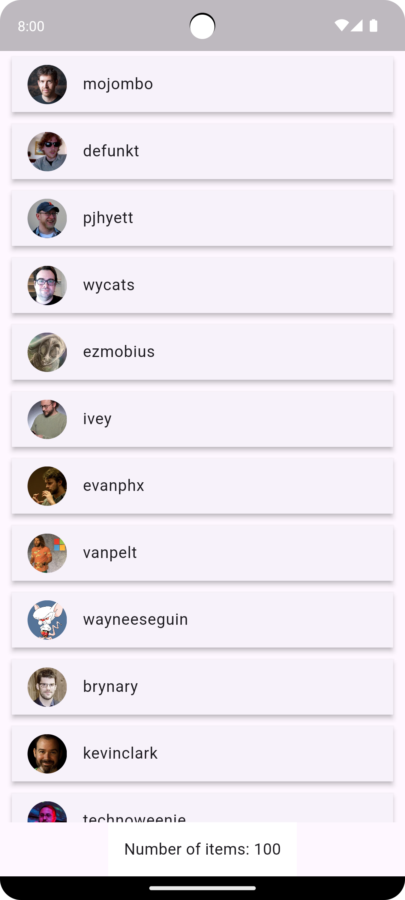
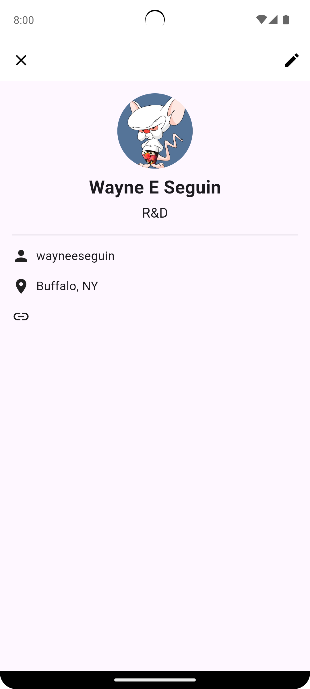
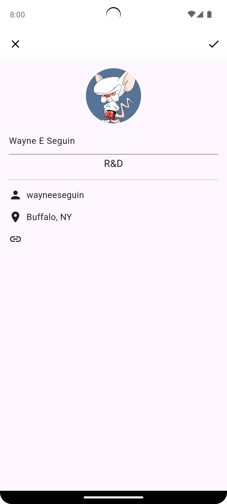
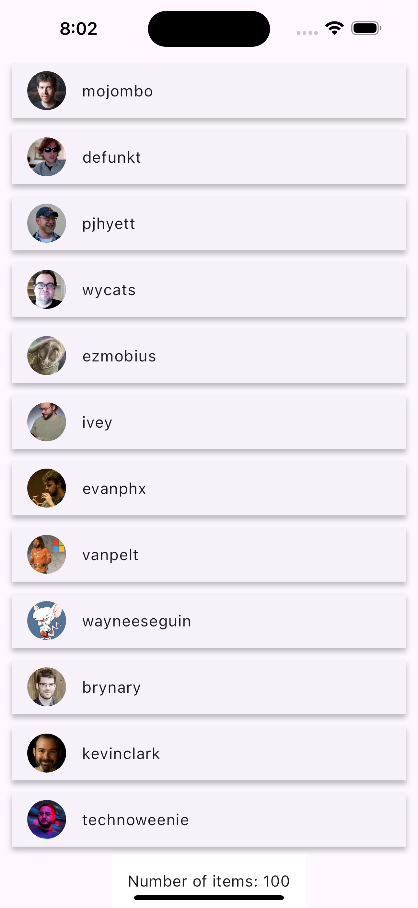
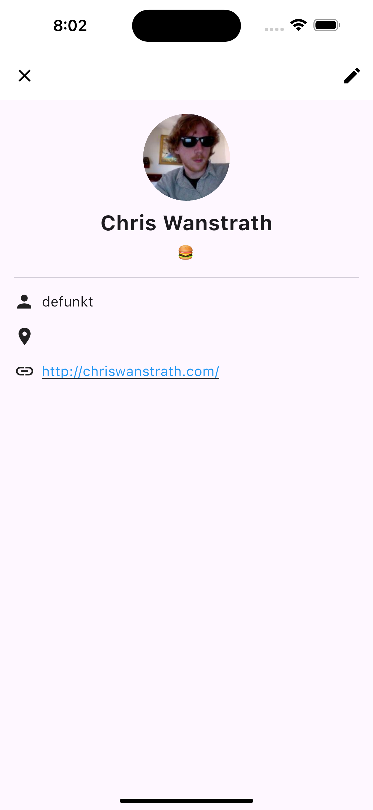
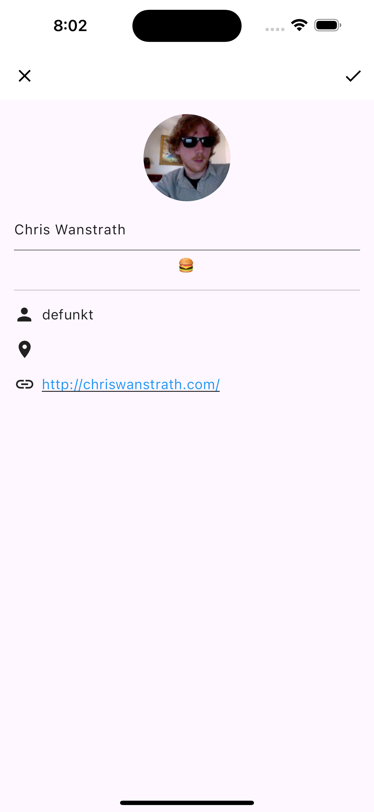

# accesslab_demo

## Project

This Project use Stacked framework for project arch.

Stacked is a framework base on provider.


## 3. Requirements

- [x] avatar_url
- [x] login
- [x] site_admin (badge)
- [x] Number of items

### OPTIONAL

- [ ] Paginated
- [ ] Starts with since=0, page size = 20
- [x] Non-paginated
- [x] Limit to 100 users

## 4. Bonus

- [x] avatar_url
- [x] name (editable)
- [x] bio
- [x] login
- [x] site_admin (badge)
- [x] location
- [x] blog
- [x] save button

## Porject Structure

``` yaml
lib/
├─ request/ # rueqets api
├─ app/ # project setting  - Plugin, service, etc..
│  ├─ app.dart # Stacked setting（Router, Singleton Service ...）
│  ├─ app.config.dart # Load Project Environment setting
│  ├─ app.environment.dart # Environment init
│
├─ services/ # common Service ex: api_service, base_service, auth_service
│
├─ ui/
│  ├─ common/ # common，include UI Guidline compoent
│  ├─ dialogs/ # dialogs 
│  ├─ views/ # page view - viewmodel & view put here

```

## Demo Image

### Android





### IOS




